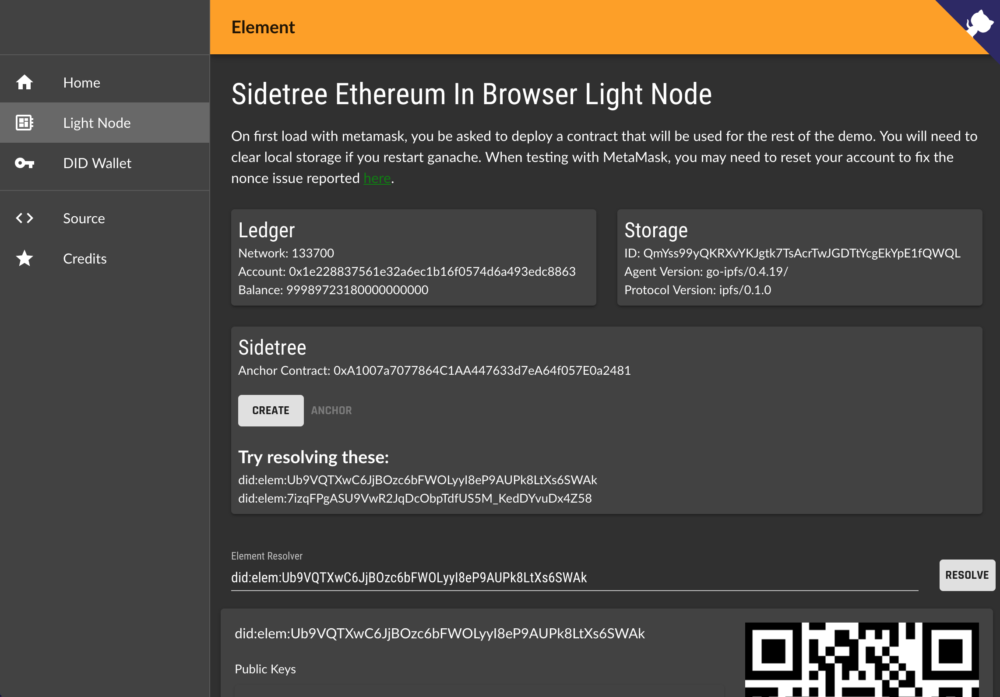

# element

[](https://travis-ci.org/decentralized-identity/element) [](https://codecov.io/gh/decentralized-identity/element)

#### 🔥 Experimental Sidetree Protocol based DID Method `elem` with Ethereum and IPFS

### [See our blog post](https://medium.com/transmute-techtalk/introducing-element-328b4260e757)

Click below image for demo video.

[](https://www.youtube.com/watch?v=KY_dt2tKQxw)

This is a lerna mono repo, see [packages](./packages) for all modules.

See also [ion](https://github.com/decentralized-identity/ion), [sidetree](https://github.com/decentralized-identity/sidetree), [sidetree-ethereum](https://github.com/decentralized-identity/sidetree-ethereum).

## Getting Started

#### Clone the repo:

```
git clone git@github.com:decentralized-identity/element.git
cd element
```

#### Install:

```
npm i
```

#### Run smart contract tests:

```
npm run test:contracts
```

#### Run lib, api and app tests:

```
npm run test
```

#### Lint

```
npm run lint
```

#### Coverage

```
npm run coverage
```

#### Publishing

If you have 2fa enabled for npm (and you should!).

```
NPM_CONFIG_OTP=123456 lerna publish
```

See [.travis.yml](./.travis.yml) for setup and test commands for linux.
